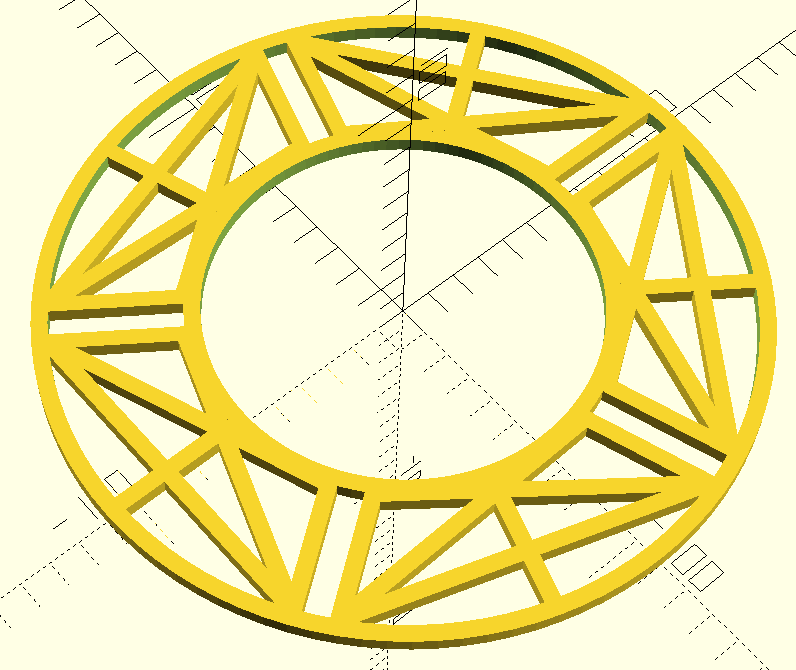

# Universal 5-Bolt Chain Guard

A 3D-printable chain guard designed to mount on 5-bolt chainring spiders for trekking, city, and touring bikes. This guard rotates with your cranks and prevents trouser legs from touching chain oil and grease.

## Design Philosophy

This chain guard uses a **universal mounting system** rather than being designed for one specific chainring. The five radial struts feature parallel rail slots that allow bolts to slide and adjust to different Bolt Circle Diameter (BCD) patterns. This means one design can fit multiple chainring configurations without reprinting.

The 5-bolt pattern is the standard for trekking and city bikes — found on Shimano Alivio, Acera, Altus, Deore, and most mid-range cranksets. Unlike MTB compact (4-bolt 104mm), trekking bikes span a wider BCD range (104–130mm) and typically run larger outer chainrings (38–52T), which drives the larger outer diameter of this guard compared to its 4-bolt sibling.

## Features

- **5-bolt compatibility**: Designed for 130mm BCD cranksets (Shimano classic trekking series)
- **Parametric design**: All dimensions can be adjusted in the OpenSCAD code
- **Structural reinforcement**: Diagonal cross-bracing, radial struts, and chord connectors between all five bolt channels
- **Rotating guard**: Mounts to chainring spider and rotates with cranks
- **Open source**: Fully customizable OpenSCAD source included

## Specifications

- **Mounting**: 5 × M8 bolts (replaces existing chainring bolts)
- **Outer diameter**: 220mm — teeth measured at 105mm from center; guard sits just outside
- **Inner diameter**: 120mm — crankset body extends 60mm from center and must be cleared entirely
- **Wall thickness**: 5mm throughout
- **Bolt channel gap**: 8mm (for M8 bolt shaft)
- **BCD range**: 130mm (see note below)
- **Material**: PLA, PETG, or ABS recommended

> **Inner diameter note**: The crankset on this bike has a **bulky central section** that extends ~60mm from the center axis. This forces a 120mm inner hole — nearly double the 70mm used in the four-bolt MTB design. As a consequence, the inner ring's outer edge sits at radius 65mm, which makes BCD patterns below 130mm physically unreachable (the bolt holes at BCD 104mm and 110mm fall inside the solid inner ring). This design targets **130mm BCD** cranksets, which is the standard for classic Shimano Trekking and road-touring cranksets (FC-T521, FC-T431, etc.).

## Design Details



### Structure

- **Two concentric rings**: Inner (~120–130mm) and outer (~210–220mm) rings provide rigid boundaries — the large inner ring is driven by the crankset's bulky central body
- **Five bolt channels**: Each strut has two 5mm walls with 8mm gap for bolt positioning and radial adjustment
- **Reinforcement elements** between each pair of adjacent channels (5 inter-strut gaps at 72° each):
  - Diagonal X-pattern bracing connecting adjacent channel walls
  - Straight chord connectors at the outer ring
  - Radial strut at the midpoint angle (36° offset from each bolt strut)

### Angular Geometry

With 5 bolts the struts sit at 72° intervals (vs. 90° for the 4-bolt version). Each inter-strut gap spans 72°, which produces slightly steeper X-brace diagonals than the 4-bolt design. The result is a denser-looking web — more material per gap due to 5 bracing sets rather than 4, but well-suited to the larger diameter.

### Why This Design?

Traditional chain guards often mount to the frame and require precise measurements for a specific bike. This design:
1. Mounts directly to the chainring spider (universal mounting point on any 5-bolt crank)
2. Uses radial bolt slots for positioning (targets 130mm BCD)
3. Rotates with cranks (no frame clearance issues)
4. Provides protection exactly where needed (at the chain/gear interface)

## Printing Guidelines

### Recommended Settings

- **Layer height**: 0.2mm
- **Infill**: 100% (high strength needed due to rotating forces)
- **Supports**: May be needed depending on printer orientation
- **Orientation**: Print flat (5mm height is the Z-axis)
- **Material**: PETG recommended for outdoor durability; PLA acceptable for testing

### Post-Processing

1. Remove any support material carefully
2. Test fit bolt channels with M8 bolts before installation
3. Check that bolt heads/nuts can clamp properly
4. Smooth any rough edges that might snag fabric

## Installation

1. Remove existing chainring bolts
2. Place chain guard over chainring spider
3. Align the five strut channels approximately with the bolt holes
4. Insert M8 bolts through channels and into chainring threads
5. Slide bolts radially until they align with mounting holes
6. Tighten bolts securely — the guard clamps between spider and crank arm
7. Test rotation: guard should spin freely with cranks

> **Tip for trekking bikes**: Many trekking cranks have a protective bash guard or ring on the outside. Check for clearance before tightening fully.

## Customization

All parameters can be adjusted at the top of the `.scad` file:

```openscad
outer_rim_diameter = 220;  // Teeth measured at 105mm from center; guard edge at 110mm
inner_rim_diameter = 120;  // Crankset body extends 60mm from center — do not reduce
thickness = 5;             // Adjust structural thickness
bolt_diameter = 8;         // Change for different bolt sizes
num_struts = 5;            // Do not change — defines 5-bolt geometry
```

## Development Notes

Designed as the trekking companion to the [four-bolt chain guard](../four-bolt-chain-guard/) for mountain bikes. The 5-bolt pattern covers the majority of trekking, city, touring, and hybrid bikes sold in Europe and worldwide.

### Target Bikes / Cranksets

Fits **130mm BCD** cranksets only (see inner diameter note above):

- Shimano FC-T521 (130mm BCD, 5-bolt)
- Shimano FC-T431 (130mm BCD, 5-bolt)
- Shimano FC-T4060 (130mm BCD, 5-bolt)
- Classic road/trekking cranksets (130mm BCD, 5-bolt)

### Status

- [x] OpenSCAD source written
- [x] STL exported
- [x] 3MF exported
- [ ] Test print completed
- [ ] Test fit on bike verified

### Not Yet Tested

- Long-term durability under riding conditions
- Compatibility with front derailleurs (trekking bikes often have 2× or 3× chainring setups)
- Clearance against chainguide or bash guard if present
- Slot adjustment range within 130mm BCD (bolt travel in channel)

## Contributing

Improvements welcome! Areas for potential enhancement:

- Testing on different trekking cranksets and BCD patterns
- Optimizing wall thickness for weight vs. strength on larger diameter
- Aesthetic improvements while maintaining function
- Variant for bikes with front derailleur clearance requirements

## License

This project is open source under the MIT License. Feel free to modify, remix, and share. Attribution appreciated but not required.

## Acknowledgments

Designed in OpenSCAD for the open-source 3D printing community. Sister project to the [four-bolt chain guard](../four-bolt-chain-guard/). Created to solve a simple problem: keeping pants clean while cycling.

## Files

- `five-bolt-chain-guard.scad` — OpenSCAD source file (fully parametric)
- `five-bolt-chain-guard.stl` — Ready-to-print STL file
- `five-bolt-chain-guard.3mf` — 3MF format (recommended)
- `scad-code.txt` — Plain-text copy of source for non-OpenSCAD readers
- `images/five-bolt-chain-guard.png` — Render preview

---

**Version**: 1.0
**Created**: April 2026
**Design Tool**: OpenSCAD
**Platform**: Linux Mint

*Happy printing and clean pants riding!*

-----------

AI assisted crafting using Claude from Anthropic.
